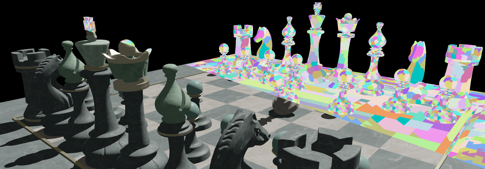

# Iškur Engine



## Overview

Iškur Engine is my personal rendering engine built with DirectX 12, designed primarily as a platform for prototyping and experimenting with graphics techniques. Its public release is intended more as a portfolio piece rather than an attempt for widespread use.

> **Note:** This GitHub repository may appear to have few commits because I primarily develop Iškur Engine on a local Git server and only sync when meaningful changes are made.

## Features

- **Mesh Shaders**
- **Meshlet Frustum Culling**: Engine-generated meshlets are culled on the GPU
- **Ray-Traced Shadows (DXR)**: BLAS and TLAS are built at runtime
- **Bindless Resources**: Bindless textures, samplers, and buffers
- **PBR Shading**
- **ACES Tone Mapping**
- **Shaders compiled at runtime (DXC)**

## Dependencies

- [DirectX 12](https://learn.microsoft.com/en-us/windows/win32/direct3d12/direct3d-12-graphics)
- [D3D12 Memory Allocator](https://github.com/GPUOpen-LibrariesAndSDKs/D3D12MemoryAllocator)
- [TinyGLTF](https://github.com/syoyo/tinygltf)
- [Meshoptimizer](https://github.com/zeux/meshoptimizer)
- [D3DX12](https://learn.microsoft.com/en-us/windows/win32/direct3d12/helper-structures-and-functions-for-d3d12)
- [Catch2](https://github.com/catchorg/Catch2)
- [DirectXMesh](https://github.com/microsoft/DirectXMesh)
- [DirectXShaderCompiler](https://github.com/microsoft/DirectXShaderCompiler)

Dependencies are managed using CMake and vcpkg.

## Getting Started

### Prerequisites

- Windows 11
- Visual Studio 2022 (ensure the following components are installed)
   - Windows 11 SDK (10.0.26100.X)
   - Clang Compiler for Windows
- CMake 4.0.2 or higher
- vcpkg for managing dependencies

### Setup Instructions

1. **Clone Repository**

   ```bash
   git clone https://github.com/tmarrec/IskurEngine.git
   cd IskurEngine
   ```

2. **Generate Project Files**

   Execute the provided batch script to automatically generate the Visual Studio solution file:

   ```bash
   build.bat
   ```

   This will create the solution file (`IskurEngine.sln`) in the `build/` directory.

3. **Build Project**

   Open `build/IskurEngine.sln` in Visual Studio and build the solution.

## Command-Line Arguments

You can specify which scene to load at startup using the `--scene` argument. For example:

```bash
IskurEngine.exe --scene BistroExterior
```

## License

Iškur Engine is licensed under the MIT License. See [LICENSE](LICENSE) for more information.

© 2025 Tristan Marrec