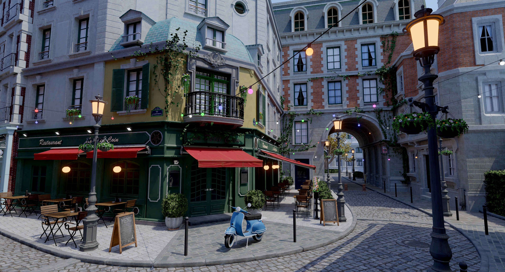
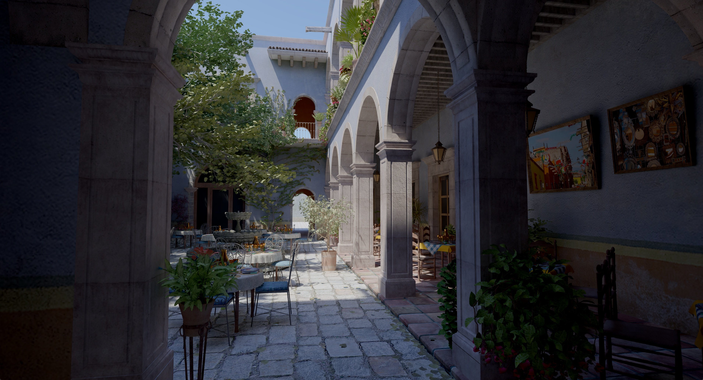
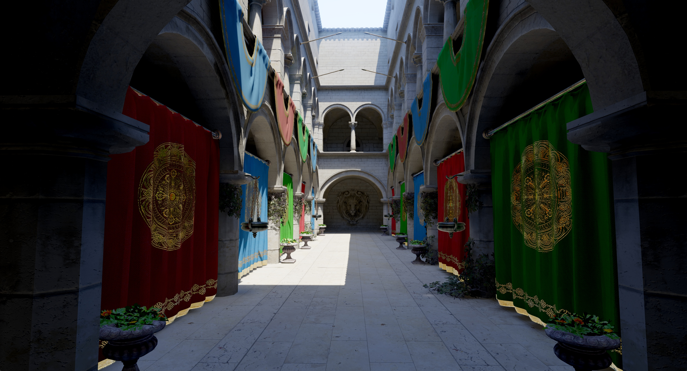
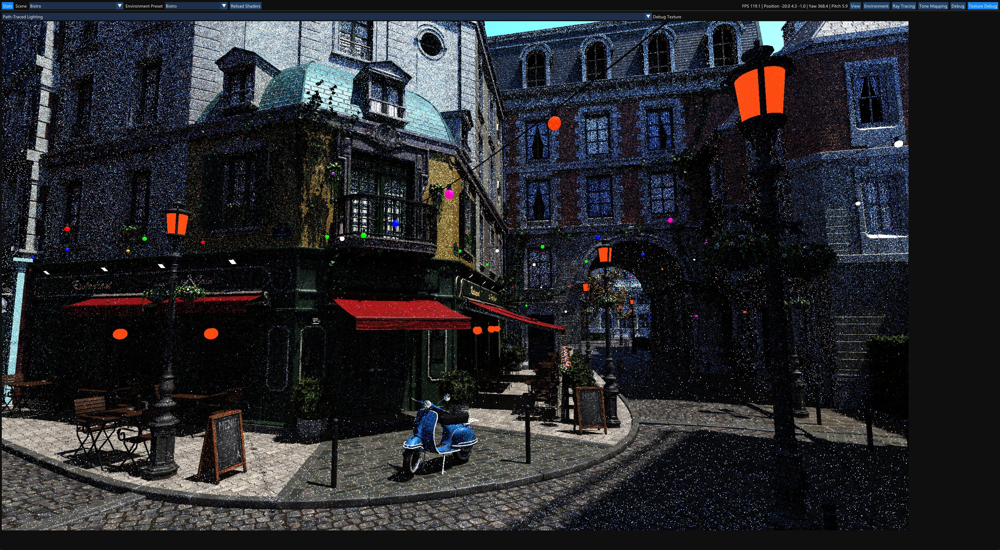
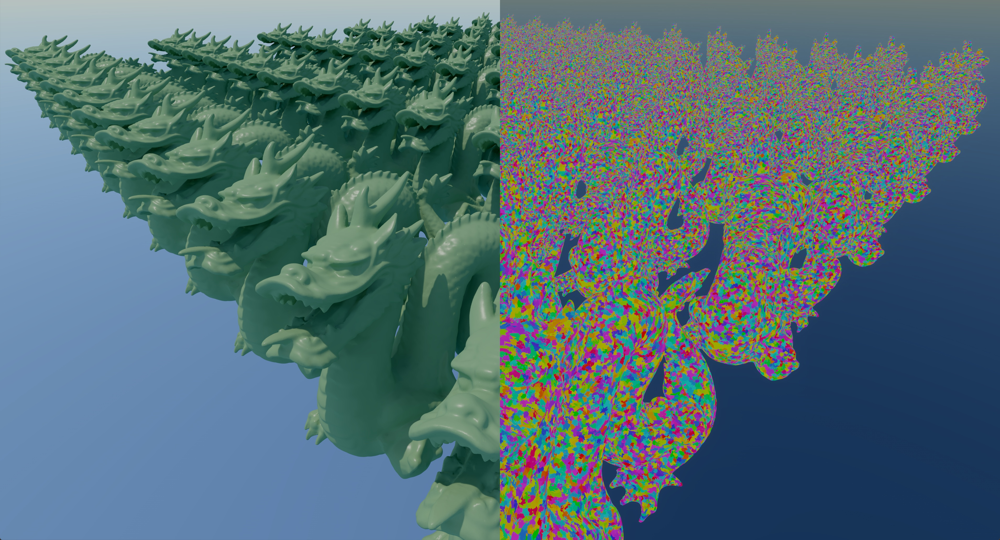
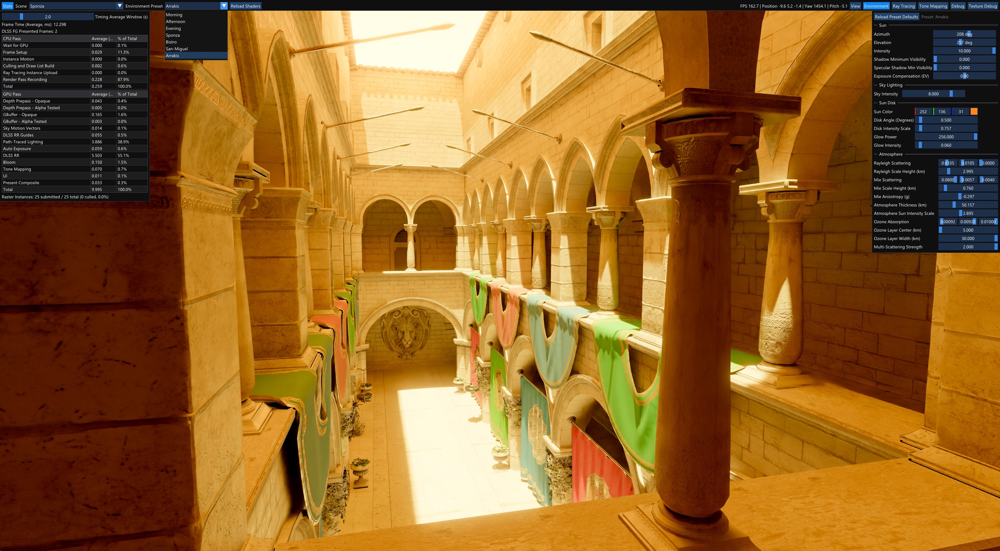

# Iškur Engine

Iškur Engine is a personal DirectX 12 rendering engine focused on prototyping and experimenting with graphics techniques. This public repository is primarily a portfolio release rather than a general-purpose engine.

> **Note:** This GitHub repository may show relatively few commits because I primarily develop Iškur Engine on a local Git server and only sync to GitHub when meaningful changes are made.

I share brief articles and experiments on computer graphics at [tmarrec.dev](https://tmarrec.dev).

## Features

- **Hardware Path-Traced Lighting**
- **Opacity Micromaps**
- **Shader Execution Reordering**
- **NVIDIA DLSS Ray Reconstruction**
- **PBR Shading**
- **Procedural Sky + Atmosphere**
- **HDR Pipeline (AgX Tone Mapping)**
- **Auto-Exposure**
- **Bloom**
- **NVIDIA DLSS Super Resolution + DLAA**
- **NVIDIA DLSS Frame Generation**
- **Mesh Shaders**
- **Meshlet Frustum and Backface Culling**
- **Bindless Resources**
- **Reverse-Z**
- **Runtime Shader Compilation**
- **Environment Presets**
- **Scene Packer**
- **Live CPU/GPU Pass Timings**
- **In-engine debugging and tuning UI**

## Screenshots

<p align="center">
  <br/>
  <em>Bistro</em>
</p>
<br/>

<p align="center">
  <br/>
  <em>San-Miguel</em>
</p>
<br/>

<p align="center">
  <br/>
  <em>Sponza</em>
</p>
<br/>

<p align="center">
  <br/>
  <em>Raw Path-Traced Lighting</em>
</p>
<br/>

<p align="center">
  <br/>
  <em>Meshlet Visualization</em>
</p>
<br/>

<p align="center">
  <br/>
  <em>Runtime Debug UI</em>
</p>

## Third-Party Dependencies

- Engine:
  - [D3D12 Memory Allocator](https://github.com/GPUOpen-LibrariesAndSDKs/D3D12MemoryAllocator)
  - [DirectXTex](https://github.com/microsoft/DirectXTex)
  - [DirectXShaderCompiler](https://github.com/microsoft/DirectXShaderCompiler)
  - [DirectX 12 Agility SDK](https://www.nuget.org/packages/Microsoft.Direct3D.D3D12)
  - [NVIDIA Streamline SDK](https://github.com/NVIDIA-RTX/Streamline)
  - [Dear ImGui](https://github.com/ocornut/imgui)
- Scene packer:
  - [meshoptimizer](https://github.com/zeux/meshoptimizer)
  - [MikkTSpace](https://github.com/mmikk/MikkTSpace)
  - [fastgltf](https://github.com/spnda/fastgltf)
  - [DirectXTex](https://github.com/microsoft/DirectXTex)

## Getting Started

### Prerequisites

- Windows 11 (up to date)
- Visual Studio 2026 (C++ desktop workload)
   - Windows 11 SDK
- CMake 4.3 or higher
- NVIDIA GeForce RTX 40 Series GPU or newer
  - I intentionally keep the hardware target narrow rather than adding extra complexity to support a wider range of GPUs.

### Setup Instructions

1. **Clone Repository**

   ```bash
   git clone https://github.com/tmarrec/IskurEngine.git
   cd IskurEngine
   ```

2. **Execute Setup Script**

   ```bash
   scripts\setup.bat
   ```

   If proprietary dependencies are missing, setup downloads Streamline and the DirectX 12 Agility SDK.
   It also downloads the compressed scene archive and extracts it into `data/scenes`, overwriting existing extracted files. These downloads may take some time and require internet access.

3. **Generate Visual Studio Solutions**

   ```bash
   scripts\generate_solution.bat
   ```

   This script configures CMake for both the engine and the scene packer, generates the Visual Studio solution files (`build/engine/IskurEngine.slnx` and
   `build/packer/IskurScenePacker.slnx`), and performs the required post-generation runtime setup.

4. **Build**

   For the IDE workflow, open `build/engine/IskurEngine.slnx` in Visual Studio and build the project there.

   For a command-line build, run:

   ```bash
   scripts\build_release.bat

   # If you want a debug build instead, run:
   # scripts\build_debug.bat
   ```

5. **Run**

   After a release build, the engine executable is available in `bin\Release`.
   After a debug build, it is available in `bin\Debug`.

   ```bash
   bin\Release\IskurEngine.exe
   ```

## Command-Line Arguments

You can specify which scene to load at startup using the `--scene` argument. For example:

```bash
IskurEngine.exe --scene Sponza
```

You can also enable the D3D12 debug layer's GPU-based validation with:

```bash
IskurEngine.exe --gpu-validation
```

## Controls

- `W/A/S/D`: move horizontally
- `Q/E`: move down/up
- `Mouse`: look around while captured
- `Shift`: move faster
- `Ctrl`: move slower
- `Space`: toggle mouse capture for freelook
- `Esc`: release mouse capture

## Scene Packer (.glb to .ikp)
glTF `.glb` scenes need to be packed using **IskurScenePacker**; it generates MikkTSpace tangents, mipmaps, compressed textures, meshlets, and opacity micromap data for runtime use.

Place your source `.glb` files in `data/scenes/sources/<SceneName>.glb`.
Running the packer will generate `data/scenes/<SceneName>.ikp`, which the engine loads at runtime.

Typical usage:
```bash
IskurScenePacker.exe --all
IskurScenePacker.exe --scene Sponza --fast
```

## License

Iškur Engine is licensed under the MIT License. See [LICENSE](LICENSE) for more information.

© 2025-2026 Tristan Marrec
