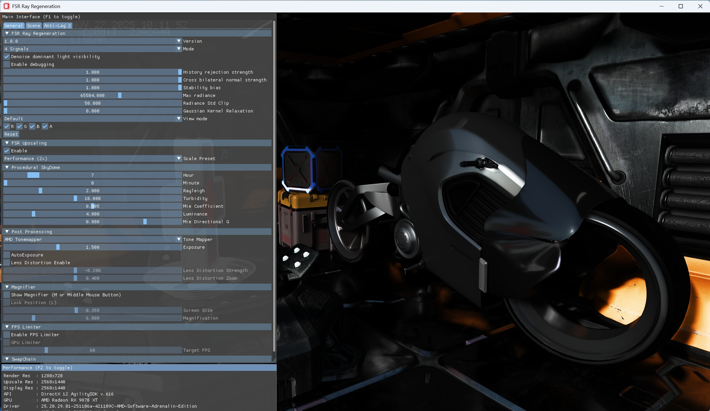

<!-- @page page_samples_denoiser FSR Ray Regeneration -->

# FSR™ Ray Regeneration Sample

This [sample](../../Samples/Denoisers/FidelityFX_Denoiser/dx12/FidelityFX_Denoiser_Sample_2022.sln) demonstrates how to integrate and experiment with FSR™ Ray Regeneration 1.0.0, a real-time ray-tracing denoising solution designed to improve the stability and visual quality of ray-traced lighting signals.

For details on the underlying algorithm, refer to the [FSR™ Ray Regeneration](../../kits/FidelityFX/docs/techniques/denoising.md) technique documentation.

## Table of contents

- [Requirements](#requirements)
- [UI elements](#ui-elements)
  - [Context creation](#context-creation)
  - [Configuration](#configuration)
  - [Dispatch](#dispatch)
  - [Display](#display)
- [Setting up FSR™ Ray Regeneration](#setting-up-fsr™-ray-regeneration)
- [Sample controls and configurations](#sample-controls-and-configurations)
- [See also](#see-also)

## Requirements

  - AMD Radeon™ RX 9000 Series GPU or later
  - DirectX®12
  - Windows

> [!NOTE]
> FSR™ Ray Regeneration is only supported on AMD Radeon™ RX 9000 Series GPUs or newer.
> On unsupported GPUs, the sample will still run, but denoising features will be disabled.

## UI elements

The sample contains various UI elements to help you explore the techniques it demonstrates.
The tables below summarize the UI elements and what they control within the sample.

### Context creation

| **Element name** | **Values** | **Description** |
| -----------------|------------|-----------------|
| **Version** | `1.0.0` | Dropdown for specifying the denoiser context version number. The newest context appears first in the list.  Sets the [`version`](../../kits/FidelityFX/denoisers/include/ffx_denoiser.h#L55) member of the [`ffxCreateContextDescDenoiser`](../../kits/FidelityFX/denoisers/include/ffx_denoiser.h#L52) context creation description. |
| **Mode** | 4 Signals, 2 Signals, 1 Signal  | Dropdown for specifying the number of signals to denoise.  Sets the [`mode`](../../kits/FidelityFX/denoisers/include/ffx_denoiser.h#L58) member of the [`ffxCreateContextDescDenoiser`](../../kits/FidelityFX/denoisers/include/ffx_denoiser.h#L52) context creation description. |
| **Denoise dominant light visibility** | Checked, Unchecked  | Checkbox for specifying whether the dominant light visibility should be denoised (as an additional separate signal).  Sets the [`FFX_DENOISER_ENABLE_DOMINANT_LIGHT`](../../kits/FidelityFX/denoisers/include/ffx_denoiser.h#L41) flag to the [`flags`](../../kits/FidelityFX/denoisers/include/ffx_denoiser.h#L59) member of the [`ffxCreateContextDescDenoiser`](../../kits/FidelityFX/denoisers/include/ffx_denoiser.h#L52) context creation description. |
| **Enable debugging** | Checked, Unchecked  | Checkbox for specifying whether debugging should be enabled.  Sets the [`FFX_DENOISER_ENABLE_DEBUGGING`](../../kits/FidelityFX/denoisers/include/ffx_denoiser.h#L40) flag to the [`flags`](../../kits/FidelityFX/denoisers/include/ffx_denoiser.h#L59) member of the [`ffxCreateContextDescDenoiser`](../../kits/FidelityFX/denoisers/include/ffx_denoiser.h#L52) context creation description. |

### Configure

| **Element name** | **Values** | **Description** |
| -----------------|------------|-----------------|
| **History rejection strength** | [0.0, 1.0] | Sets the [`historyRejectionStrength`](../../kits/FidelityFX/denoisers/include/ffx_denoiser.h#L78) member of the [`FfxApiDenoiserSettings`](../../kits/FidelityFX/denoisers/include/ffx_denoiser.h#L76) configuration description. |
| **Cross bilateral normal strength** | [0.0, 1.0] | Sets the [`crossBilateralNormalStrength`](../../kits/FidelityFX/denoisers/include/ffx_denoiser.h#L79) member of the [`FfxApiDenoiserSettings`](../../kits/FidelityFX/denoisers/include/ffx_denoiser.h#L76) configuration description. |
| **Stability bias** | [0.0, 1.0] | Sets the [`stabilityBias`](../../kits/FidelityFX/denoisers/include/ffx_denoiser.h#L80) member of the [`FfxApiDenoiserSettings`](../../kits/FidelityFX/denoisers/include/ffx_denoiser.h#L76) configuration description. |
| **Max radiance** | [0.0, 100000.0] | Sets the [`maxRadiance`](../../kits/FidelityFX/denoisers/include/ffx_denoiser.h#L81) member of the [`FfxApiDenoiserSettings`](../../kits/FidelityFX/denoisers/include/ffx_denoiser.h#L76) configuration description. |
| **Radiance std clip** | [0.0, 100000.0] | Sets the [`radianceClipStdK`](../../kits/FidelityFX/denoisers/include/ffx_denoiser.h#L82) member of the [`FfxApiDenoiserSettings`](../../kits/FidelityFX/denoisers/include/ffx_denoiser.h#L76) configuration description. |
| **Gaussian kernel relaxation** | [0.0, 1.0] | Sets the [`gaussianKernelRelaxation`](../../kits/FidelityFX/denoisers/include/ffx_denoiser.h#L83) member of the [`FfxApiDenoiserSettings`](../../kits/FidelityFX/denoisers/include/ffx_denoiser.h#L76) configuration description. |

### Dispatch

| **Element name** | **Values** | **Description** |
| -----------------|------------|-----------------|
| **Reset** | NA | Button for resetting the history accumulation.  Sets the [`FFX_DENOISER_DISPATCH_RESET`](../../kits/FidelityFX/denoisers/include/ffx_denoiser.h#L64) flag on the [`flags`](../../kits/FidelityFX/denoisers/include/ffx_denoiser.h#L116) member of the [`ffxDispatchDescDenoiser`](../../kits/FidelityFX/denoisers/include/ffx_denoiser.h#L89) dispatch description. |

### Display

| **Element name** | **Values** | **Description** |
| -----------------|------------|-----------------|
| **View mode** | Default, Default (Input), Direct, Direct diffuse, Direct specular, Indirect, Indirect diffuse, Indirect specular, Direct (Input), Direct diffuse (Input), Direct specular (Input), Indirect (Input), Indirect diffuse (Input), Indirect specular (Input), Linear depth, Motion vectors, Normals, Specular albedo, Diffuse albedo, Fused albedo, Skip signal | Dropdown for specifying the view mode to display. |
| ${\color{red}R}$ ${\color{green}G}$ ${\color{blue}B}$ ${\color{white}A}$ | Checked, Unchecked  | Checkboxes for specifying which color channels (i.e. ${\color{red}red}$, ${\color{green}green}$, ${\color{blue}blue}$, ${\color{white}alpha}$) of the selected view mode should be displayed. |

## Setting up FSR™ Ray Regeneration

The sample includes a [dedicated Render Module for FSR™ Ray Regeneration](../../Samples/Denoisers/FidelityFX_Denoiser/dx12/denoiserrendermodule.h) which creates the context and manages its lifetime. See the [FSR™ Ray Regeneration](../../kits/FidelityFX/docs/techniques/denoising.md) technique documentation for more details.

## Sample controls and configurations

For information on sample controls, configuration options, and Cauldron Framework UI elements, see [Running the samples](../getting-started/running-samples.md).

## See also

- [FSR™ Ray Regeneration API](../../kits/FidelityFX/denoisers/include/ffx_denoiser.h)
- [FSR™ Ray Regeneration technique documentation](../../kits/FidelityFX/docs/techniques/denoising.md)