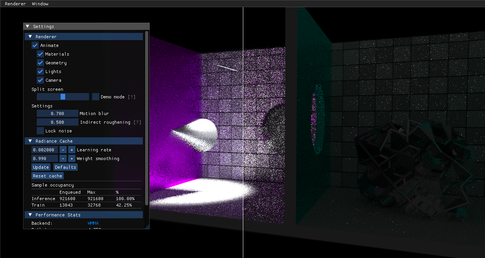

<!-- @page page_samples_nrc FidelityFX NRC (Technical Preview) -->

<h1>FidelityFX NRC (Technical Preview) Sample</h1>

This sample demonstrates the use of FSR™ Radiance Caching (Preview).

For details on the underlying algorithm you can refer to the technique documentation for [FSR™ Radiance Caching (Preview)](../../Kits/FidelityFX/docs/techniques/radiance-cache.md).

<h2>Requirements</h2>

 - Windows
 - DirectX(R)12

<h2>See also</h2>

- [FSR™ Radiance Caching (Preview)](../../Kits/FidelityFX/docs/techniques/radiance-cache.md)
